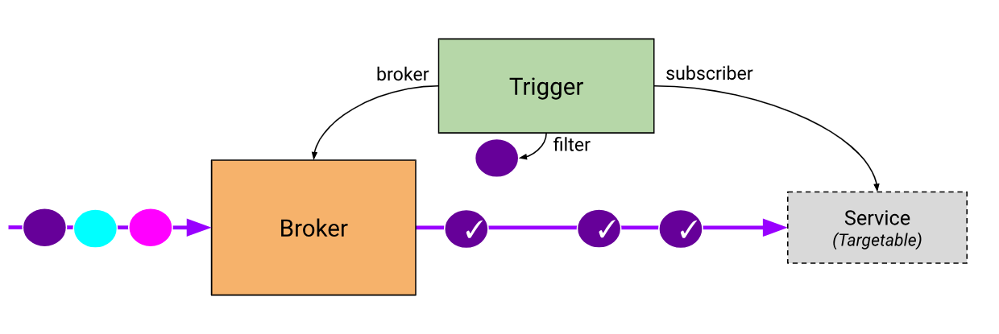

## Broker Trigger
> 介绍 Knative 的 Broker trigger 模型

### 1. Default Broker

当 `namespace` 或者 `trigger` 携带 `label` `eventing.knative.dev/injection:true` 时，`sugar-controller` 会自动生成对应的 `Broker` 实例

sugar-controller 中包含两个 controller
- namespace controller
- trigger controller

作用：判断 namespace 或 trigger 是否携带 label `eventing.knative.dev/injection:true`，如果有则在同 namespace 下 创建名为 default 的  Broker

### 2. channel 的生成

Broker 的 创建 会触发 channel 的创建，mt-broker-controller 会 watch Broker 的创建，根据 channeltemplate 生成对应的 channel

`Natss-ch-controller` 会 `watch` 这个 `channel` , 生成 `external service`（`external service` 的地址指向  `natss-ch-dispatcher`）

